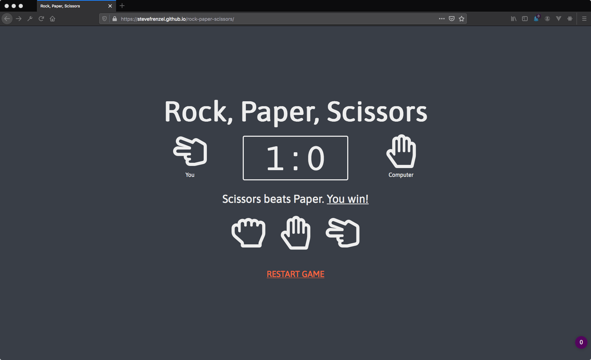

# Rock, Paper, Scissors



## 1. Description 📝

A classic "Rock, Paper, Scissors" game utilising HTML, CSS and JavaScript. If the user and computer make the same choice it's a draw, otherwise the following rules will apply:

- Rock beats scissors
- Paper beats rock
- Scissors beat paper

## 2. Structure 🗂

This app is as basic as can be! `index.html` contains the content, `style.css` the visual appearance and `script.js` the logic and functionality.

The `index.html` has four elements:

1. Header
2. Counter
3. Result message
4. Restart

In the counter element, the computer choice will be randomly generated:

```javascript
function getComputerChoice() {
        const choices = ['Rock', 'Paper', 'Scissors'];
        const randomNumber = Math.floor(Math.random() * 3);
        return choices[randomNumber];
    }
```

Depending on the choice of the user inside the `choices-wrapper`element, either the `win()`, `lose()` or `draw()` function will run. Each one indicates the result by a flash of green, red or gray color on the whole screen:

```javascript
function game(userChoice) {
        const computerChoice = getComputerChoice();
        if (
            (userChoice === 'Rock' && computerChoice === 'Scissors') ||
            (userChoice === 'Paper' && computerChoice === 'Rock') ||
            (userChoice === 'Scissors' && computerChoice === 'Paper')) {
            win(userChoice, computerChoice);
            wrapper.classList.add('green-glow');
            setTimeout(() => wrapper.classList.remove('green-glow'), 300);
        } else if (
            (userChoice === 'Rock' && computerChoice === 'Paper') ||
            (userChoice === 'Paper' && computerChoice === 'Scissors') ||
            (userChoice === 'Scissors' && computerChoice === 'Rock')) {
            lose(userChoice, computerChoice);
            wrapper.classList.add('red-glow');
            setTimeout(() => wrapper.classList.remove('red-glow'), 300);
        } else {
            draw(userChoice, computerChoice);
            wrapper.classList.add('gray-glow');
            setTimeout(() => wrapper.classList.remove('gray-glow'), 300);
        }
    }
```

To restart the game, an eventListener will check if the value of `userScoreValue` or `computerScoreValue` is above 0. If so, both values will be set to 0 again:

```javascript
restart.addEventListener('click', function() {
        if (userScoreValue > 0) {
            userScoreValue = 0;
            userScore.innerHTML = userScoreValue;
        }
        if (computerScoreValue > 0) {
            computerScoreValue = 0;
            computerScore.innerHTML = computerScoreValue;
        }
    });
```